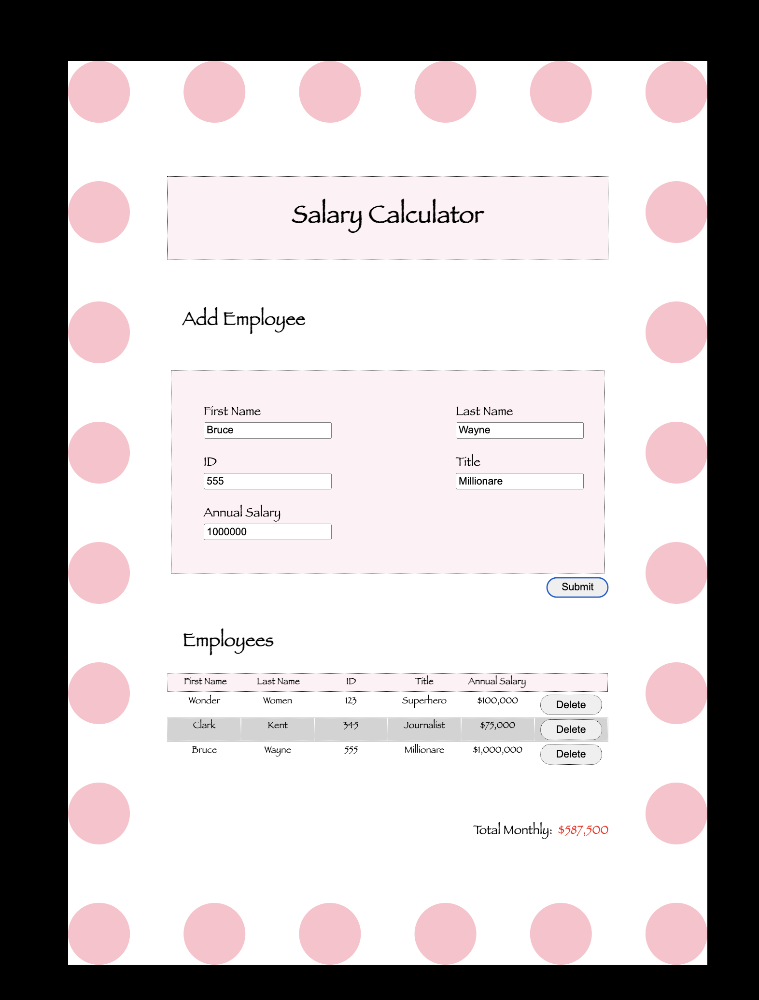

# Weekend Salary Calculator

## Description

_Duration: 3-days (weekend)_

A simple web application that takes in each **employeee** information, including annual salary and then calculates the total monthly cost of all the employees.

To see the fully functional site, please visit: [Salary Calculator](https://susie-d.github.io/weekend-salary-calculator/)

## Screen Shot

### Prerequisites

There is no software that is required to install the app. However there is an optional app for testing. If a developer would like to run test scripts, Node is needed:

- [Node.js](https://nodejs.org/en/)

## Installation

The frontend application can be open with the `index.html` file in a web browser of your choice.

For testing, after the installation:

- Open up your terminal of choice and run an `npm install`
- Run `npm run test` in your terminal

## Usage

How does someone use this application?

1. A simple web application that takes in **employeee** information that will require a user's input
    - First Name
    - Last Name
    - Id
    - Title
    - Annual Salary

1. After completing 
    - First Name
    - Last Name
    - Id
    - Title
    - Annual Salary

Each employee has a annual salary that will be added by the user. The monthly total will be determined by the total annual salary of all employees. The user will also have the option to remove the employee information with the delete button.

## Built With

- Javascript
- HTML
- CSS

## Acknowledgement

Thanks to [Prime Digital Academy](www.primeacademy.io) who equipped and helped me to make this application a reality.

## Support

If you have suggestions or issues, please email me at [youremail@whatever.com](www.google.com)
